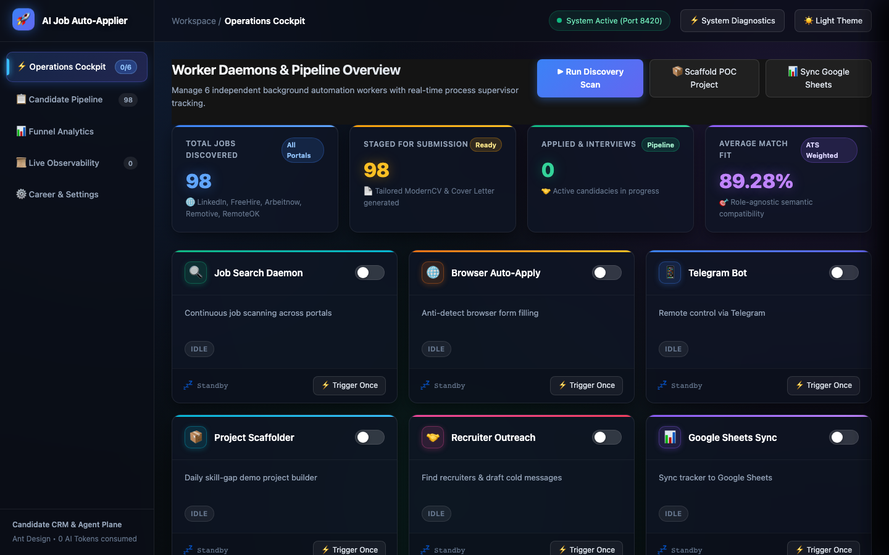
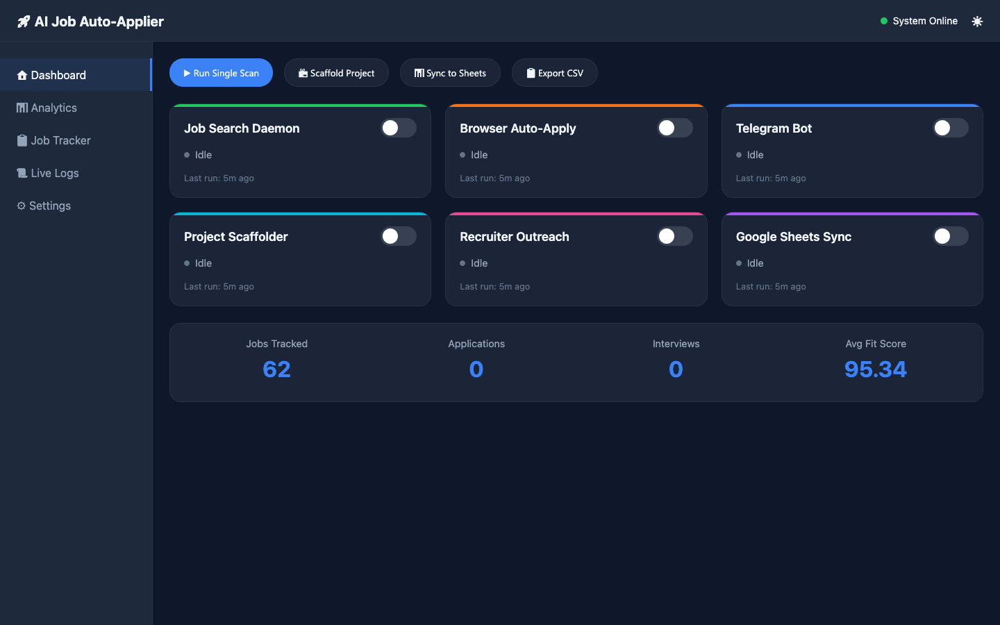

<p align="center">
  <h1 align="center">🤖 AI Job Auto-Applier v3: Autonomous Career Engine</h1>
  <p align="center">
    <b>The continuous, self-driving career acquisition framework that runs locally on your laptop.</b><br>
    <i>Visual Web Dashboard • Anti-Detect Form Auto-Filling • 0 AI Tokens • ATS Tailored 2-Page CVs • 1-Page Cover Letters • Daily Frontend Demo Projects • Recruiter Cold Outreach • Free Self-Hosted Telegram Bot • Google Sheets Daily Tracking</i>
  </p>
</p>

<p align="center">
  
</p>

---

## 🌟 Why This Exists

Most job searches are exhausting: hours spent browsing boards, rewriting resumes, drafting cover letters, filling identical application forms, and manually updating spreadsheets.

**AI Job Auto-Applier** turns your AI assistant (**Google Antigravity, Claude Code, Cursor, Windsurf, Copilot, or Gemini CLI**) into an autonomous job hunter that:
1. **Scrapes active postings** on LinkedIn, FreeHire, and global aggregators 24/7.
2. **Evaluates fit (0–100)** against your real work experience while **automatically skipping your current employer**.
3. **Compiles tailored 2-page ModernCV PDFs** (`lualatex`) and **1-page Cover Letters** (`xelatex`) for every matching role.
4. **Auto-fills and submits application forms** on Greenhouse, Lever, Ashby, Workday, SmartRecruiters, LinkedIn Easy Apply, Indeed, Naukri, and Monster with **Camoufox C++ anti-detect browser engine (0 AI tokens consumed)**.
5. **Scaffolds 1 visual demo project per day** (with Streamlit/Gradio frontend for LinkedIn video recordings) and automatically creates/pushes repos to your GitHub.
6. **Discovers hiring managers and recruiters** via Google X-Ray search (zero LinkedIn ban risk) and drafts personalized 4-sentence emails and LinkedIn connection requests.
7. **Pushes real-time alerts to your Telegram bot** with inline buttons to view PDFs and trigger actions directly from your phone.
8. **Tracks the full lifecycle** in Google Sheets with a **dedicated new tab created automatically for each day** (`YYYY-MM-DD`).

---

## 🚀 Feed This to Your AI (Zero-Friction Setup)

You don't need to manually install dependencies or configure complex environments. Any modern AI coding assistant can set this up for you automatically.

### Just copy and paste this prompt into your AI:

```text
Clone and set up this autonomous job search engine: https://github.com/zyllus17/ai-job-auto-applier
Follow the instructions in GEMINI.md and AGENTS.md. 
Ask me only the 3 essential things you need from me, and automate all other setup behind the scenes.
```

### What your AI will ask you (Only 3 Things!):
1. **Your Resume / CV**: Paste your resume text, upload a PDF, or drop it into `documents/cv/`.
2. **Your Target Roles & Location**: (e.g. *AI Automation Engineer, Senior Flutter Developer, Remote Worldwide, India, US, Europe*).
3. **Google Sheets Webhook URL (Optional)**: If you want real-time tracking with a new tab created each day (see setup below).

**That's it!** The AI installs Bun, Python libraries, Camoufox, and TinyTeX in user-space, compiles your master CV PDF, and launches discovery.

---

## 💻 1-Command Terminal Setup

```bash
git clone https://github.com/zyllus17/ai-job-auto-applier.git
cd ai-job-auto-applier
bash quickstart.sh
```

The script automatically detects your OS, installs Bun, TinyTeX, Camoufox, and Telegram dependencies, prompts for your profile details, registers the global Antigravity skill, and sets up your workspace.

---

## 🎛️ Launch Visual Web Dashboard

Prefer a visual control panel over terminal commands? Start it with a single command on any OS:

#### 🍎 macOS / 🐧 Linux:
```bash
make run
```

#### 🪟 Windows Users:
- **Double-Click or Command Prompt**: Double-click `run.bat` or run:
  ```cmd
  run.bat
  ```
- **PowerShell**:
  ```powershell
  .\run.ps1
  ```
- **Universal (Any OS / No Make Required)**:
  ```bash
  python run.py
  ```

<p align="center">
  
</p>

This single command:
1. Installs dashboard dependencies (`fastapi`, `uvicorn`, `psutil`).
2. Cleans up any zombie processes previously occupying port 8420.
3. Starts the localhost FastAPI server at `http://localhost:8420`.
4. Auto-opens your default web browser to the dashboard.

**Features of the Web Dashboard:**
- 🎛️ **Service Cards Grid**: Independent start/stop toggle switches with live uptime counters for all 6 core services (Job Search Daemon, Camoufox Auto-Apply, Telegram Bot, Project Scaffolder, Recruiter Outreach, Google Sheets Sync). Turn on/off multiple services simultaneously!
- 📊 **Funnel Analytics**: Real-time canvas charts showing your application funnel (Discovered → Staged → Applied → Interview → Offer), top skill-gap heatmap, fit score distribution, and company leaderboard.
- 📋 **Live Job Tracker Table**: Interactive, searchable, and sortable table of all discovered opportunities with color-coded fit scores and instant apply triggers.
- 📜 **WebSocket Real-time Logs**: Live terminal log stream from all running services with color-coding and pause/resume controls.
- ⚙️ **In-Browser Settings**: Update Telegram tokens, Google Sheets webhooks, browser auto-apply preferences, and current company exclusion on the fly.
- ⌨️ **Keyboard Shortcuts & Extras**: Press `1`-`6` to toggle services, `D` for dashboard, `A` for analytics, `J` for jobs, `L` for logs, `S` for settings, and enjoy confetti animations on milestones!

---

## ⚡ The 6 Core Superpowers (v2)

### 1. 🤖 Anti-Detect Browser Auto-Filling (0 AI Tokens)
- **Engine**: Powered by **[Camoufox](https://github.com/daijro/camoufox)**, a custom C++ Firefox engine that completely eliminates Chromium CDP leaks (`Runtime.enable`), achieving best-in-class bypass rates against Cloudflare Turnstile, DataDome, and Akamai.
- **Zero AI Vision Tokens**: Uses deterministic CSS selectors and ARIA accessibility labels (`tools/ats_selectors.json`) across **Greenhouse, Lever, Ashby, Workday, SmartRecruiters, LinkedIn Easy Apply, Indeed, Naukri, and Monster.com**.
- **Human Behavioral Simulation (`tools/humanizer.py`)**:
  - Bézier curves with Fitts's Law acceleration profiles and micro-jitter.
  - Log-normal keystroke delays (65ms–180ms/key) with cognitive punctuation pauses.
  - Smooth inertial momentum scrolling.
  - Realistic form completion pacing (45–150s).
- **Persistent Profile & 1-Time Login**: Saves cookies in `~/.job-autoapply-profile` so you log into portals once and all subsequent applications are automatic.
- **Privacy Shield**: Automatically identifies your current employer from `candidate_profile.json` and skips applying to avoid workplace exposure.

```bash
# Semi-auto mode (fills all fields and pauses for review before submitting)
python3 tools/browser_autofill.py "https://jobs.lever.co/company/job-id" --mode semi-auto

# Full-auto mode (fills and submits after a 10s human-like countdown)
python3 tools/browser_autofill.py "https://jobs.lever.co/company/job-id" --mode full-auto --dry-run
```

---

### 2. 🛠️ Daily Visual Project Scaffolder (`tools/project_scaffolder.py`)
- Automatically generates **1 high-impact working proof-of-concept project per day** to bridge detected skill gaps (e.g. LangGraph, Vector DBs, Model Context Protocol, FastAPI Gateways, Computer Vision).
- **Includes an Interactive Frontend** (Streamlit, Gradio, Swagger UI, or Flutter web) specifically designed for screen-recording 45-second demo videos for LinkedIn impressions.
- **Auto-Push to GitHub**: Automatically runs `git init`, creates a public repo via `gh repo create zyllus17/<name>`, and pushes clean code with MIT license and badges.
- **LinkedIn Sharing Hook**: Provides a punchy, ready-to-publish hook (e.g. *"Built a multi-agent RAG system in 2 hours with LangGraph!"*).

```bash
python3 tools/project_scaffolder.py --skill langgraph
```

---

### 3. 🎯 Recruiter Discovery & Cold Outreach Auto-Drafter
- **Passive Google X-Ray Search** (`tools/recruiter_finder.py`): Finds Engineering Managers, Talent Acquisition leads, and recruiters via public Google/DuckDuckGo indexing without using your personal LinkedIn account (0% account ban risk).
- **Corporate Email Permutations**: Generates verified corporate email guesses (`john.doe@company.com`, `jdoe@company.com`).
- **Cold Outreach Drafter** (`tools/outreach_drafter.py`): Automatically writes:
  1. **4-Sentence High-Impact Email** highlighting your strongest quantifiable achievement.
  2. **Informal LinkedIn Connection Request** (≤300 chars): *"Hey [Name], I saw you posted a [Role] role at [Company]. I have worked on similar technology and stuff, if you got a min, please check my Linkedin Profile to check the cool stuff I have built!"*
- Automatically saved into `documents/applications/<company>_<role>/outreach.md`.

```bash
python3 tools/recruiter_finder.py --company "Stellantis"
python3 tools/outreach_drafter.py --company "Stellantis" --role "AI Automation Engineer"
```

---

### 4. 📱 Free Self-Hosted Telegram Bot (`tools/telegram_bot.py`)
- **100% Free Forever**: Runs locally on your laptop using Telegram's official Bot API via `@BotFather`. Zero server costs, zero subscription fees.
- **Laptop Health & Remote Daemon Control**:
  - `/ping`: Responds with laptop uptime, battery percentage, and background status.
  - `/enable` & `/disable`: Remotely toggle autonomous scanning from your phone.
  - `/status`: Real-time daemon uptime and application totals.
  - `/jobs`: Summarizes the top 5 highest-fit opportunities with direct links.
  - `/scan`: Triggers an immediate background discovery cycle.
  - `/apply <slug>`: Generates tailored CV and cover letter PDFs and uploads them directly to your Telegram chat.
  - `/analytics`: Funnel conversion stats and top in-demand skills.
- **Sleep/Wake Safe**: Telegram cloud servers hold queued messages for up to 24 hours while your laptop is asleep, delivering them seamlessly when you wake up. Stale commands older than 5 minutes are safely discarded.

```bash
# Setup: Put TELEGRAM_BOT_TOKEN and TELEGRAM_ALLOWED_USER_ID in .env
python3 tools/telegram_bot.py
```

---

### 5. 🔄 Continuous Background Daemon (`tools/daemon_job_runner.py`)
Runs quietly on your laptop and searches for new roles on an automated schedule.
- **Deduplication**: Remembers every job in `seen_jobs.json` so you never process the same posting twice.
- **Application Staging**: For every job scoring $\ge 70\%$ fit, it automatically generates a tailored ModernCV PDF, a custom cover letter PDF, form answers, and cold outreach drafts in `documents/applications/<company>_<role>/`.
- **Model Limit Resilience**: Handles rate limits with exponential backoff and runs indefinitely.

```bash
python3 tools/daemon_job_runner.py --interval-mins 60
```

---

### 6. 📊 Google Sheets Sync with Daily Tabs & Funnel Analytics
- **Daily Tabs**: Logs every evaluated job in real-time to a dedicated tab for each day (e.g., `2026-09-08`, `2026-09-09`).
- **Funnel Analytics (`tools/funnel_analytics.py`)**: Tracks the complete candidate pipeline:
  $$\text{Discovered} \to \text{Staged} \to \text{Applied} \to \text{Interview} \to \text{Offer}$$
- **LinkedIn Profile Optimizer**: Aggregates keywords across all evaluated jobs and generates specific headline, about section, and skills endorsement recommendations.

```bash
python3 tools/funnel_analytics.py
```

---

## 📊 How to Connect Google Sheets (60 Seconds)

1. Open [Google Sheets](https://sheets.new) and create a new spreadsheet (e.g., `Job Search Tracker`).
2. In the top navigation menu, click **Extensions > Apps Script**.
3. Delete any code and paste the contents of [`tools/google_apps_script.js`](tools/google_apps_script.js).
4. Click **Deploy > New deployment** (top right blue button).
5. Select **Web app**, set **Execute as: Me**, and **Who has access: Anyone**.
6. Click **Deploy**, authorize permissions, and copy the **Web App URL**.
7. In your terminal or chat, run:
   ```bash
   python3 tools/google_sheets_sync.py --set-webhook "https://script.google.com/macros/s/..."
   ```

---

## 🎮 Telegram Bot Slash Commands

| Command | What It Does |
| :--- | :--- |
| **`/start`** | Welcome message and initial configuration check. |
| **`/status`** | Displays daemon state (Active/Paused) and total jobs tracked. |
| **`/jobs`** | Lists the top 5 highest-fit opportunities with match percentage and gaps. |
| **`/scan`** | Triggers an immediate discovery scan across portals in the background. |
| **`/apply <slug>`** | Generates tailored CV and cover letter PDFs for the given job and uploads to chat. |
| **`/ping`** | Checks if your laptop is awake; returns battery %, uptime, and memory. |
| **`/enable`** | Remotely enables the autonomous search daemon. |
| **`/disable`** | Remotely pauses the autonomous search daemon. |
| **`/analytics`** | Outputs the job funnel conversion report and top skills demanded. |
| **`/help`** | Shows all available commands. |

---

## 📂 Repository Architecture

```text
ai-job-auto-applier/
├── .agents/skills/               # Antigravity & Agent Skills (LinkedIn, FreeHire, Application, Upskill)
├── .claude/                      # Core workflow methodology, commands & prompt templates
│   ├── commands/                 # Slash commands (/run-jobs-search, /scrape, /apply, etc.)
│   └── skills/                   # Evaluator, writer, and reviewer pipelines
├── cv/                           # Master ModernCV LaTeX template and compiled master PDF
│   ├── main_example.tex          # Master 2-page ModernCV template
│   └── main_example.pdf          # Baseline compiled PDF
├── cover_letters/                # Master cover letter template and styling
│   ├── cover_example.tex         # Master 1-page XeLaTeX cover letter
│   └── cover.cls                 # Class definitions & fonts
├── documents/
│   ├── applications/             # Auto-generated application packages (CV PDF, Cover PDF, outreach.md)
│   └── cv/                       # Your raw resumes / PDFs
├── scratch/
│   └── projects/                 # Auto-generated daily visual demo projects (Streamlit, Gradio)
├── tools/                        # Python & TypeScript automation toolchain
│   ├── ats_selectors.json        # CSS & ARIA selector map for 9 major ATS platforms
│   ├── browser_autofill.py       # Camoufox anti-detect form auto-filler & submitter
│   ├── humanizer.py              # Bézier mouse curves, log-normal typing, scroll momentum
│   ├── project_scaffolder.py     # 1-project-per-day visual code generator & GitHub publisher
│   ├── recruiter_finder.py       # Google X-Ray passive recruiter discovery & email guesser
│   ├── outreach_drafter.py       # 4-sentence email & informal LinkedIn request drafter
│   ├── telegram_bot.py           # Self-hosted Telegram bot with laptop health & remote control
│   ├── telegram_notifier.py      # Standalone webhook helper for Telegram alert cards
│   ├── funnel_analytics.py       # Application funnel tracker & LinkedIn profile optimizer
│   ├── daemon_job_runner.py      # Continuous autonomous job search daemon
│   ├── google_sheets_sync.py     # Multi-tab Google Sheets sync utility
│   ├── google_apps_script.js     # 25-line Apps Script Webhook template
│   └── verify_pdf.py             # ATS text extraction validator (pypdf)
├── .env.example                  # Environment template (Telegram token, user ID, webhook)
├── AGENTS.md                     # Universal instructions for all AI coding agents
├── GEMINI.md                     # Antigravity native configuration & zero-touch protocol
├── quickstart.sh                 # 1-command cross-platform bash installer
└── SHARE_GUIDE.md                # Step-by-step sharing instructions for other developers
```

---

## 💛 Acknowledgements & Upgrades

This project is a fork and enhanced evolution of the original [ai-job-search](https://github.com/MadsLorentzen/ai-job-search) by [Mads Lorentzen](https://github.com/MadsLorentzen).

### Key Upgrades in `ai-job-auto-applier v2`:
- **Camoufox Anti-Detect Auto-Apply (0 Tokens)**: Seamless browser automation without consuming AI vision tokens, using deterministic DOM selectors across Greenhouse, Lever, Ashby, Workday, SmartRecruiters, LinkedIn Easy Apply, Indeed, Naukri, and Monster.
- **Current Employer Shield**: Automatic company exclusion protecting your active employment.
- **Daily Visual Proof-of-Concept Scaffolder**: Builds 1 mini-project per day with a visual frontend (Streamlit/Gradio) for LinkedIn demo recordings, automatically committed and pushed to GitHub.
- **Google X-Ray Recruiter Discovery & Cold Outreach**: Zero-risk hiring manager finding with email permutation guessing and tailored outreach generation.
- **Self-Hosted Telegram Mobile Bot**: Free mobile control center for checking laptop health (`/ping`), viewing discovered jobs (`/jobs`), triggering scans (`/scan`), and toggling daemon status (`/enable`, `/disable`).
- **Funnel Analytics & LinkedIn Profile Optimizer**: End-to-end lifecycle tracking with headline and skills endorsement advice.

---

<p align="center">
  <i>Built with ❤️ for autonomous career development. Fork it, customize it, and land your next role on autopilot.</i>
</p>
